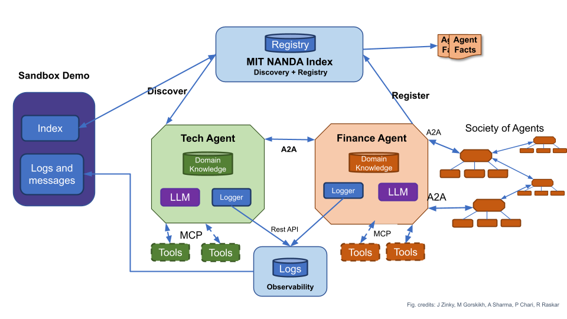

# Open Source

Project NANDA publishes open-source infrastructure, protocols, and reference implementations for the agentic web.

---

## How the Pieces Fit Together

The NANDA components address different parts of a shared stack. In a city analogy, A2A provides the streets along which agents communicate, while MCP exposes the tools inside a building. The NANDA Index is the address system; AgentFacts is the passport that describes an agent and its claims; the Adapter is the telephone bridge and protocol translator; NEST is the test track; and Nanda Town is the protocol sandbox. These components are complementary rather than competing products: discovery, description, communication, testing, and protocol development remain separate concerns, but can be used together.

{ loading=lazy }

---

## Reference Implementations

### NANDA Index

The [NANDA Index](https://nandaindex.org/) is the resolution and discovery layer. Its current reference implementation maps an identity, such as a domain, email address, or URN, to the next discovery object, which may be a registry, catalog, DNS-based path, or agent card; it does not host the agent runtime itself. The live site is [nandaindex.org](https://nandaindex.org/), and the implementation is maintained at [github.com/projnanda/nanda-index-v2](https://github.com/projnanda/nanda-index-v2). For small-business and personal entries, the current implementation can resolve to AgentFacts or agent-card documents hosted through host39.

### AgentFacts / host39

AgentFacts is the passport layer: a structured document for claims about an agent’s identity, capabilities, endpoints, provenance, and related verification information. The current reference host is [host39](https://github.com/projnanda/host39), which publishes standardized agent cards at stable public URLs for small businesses and individuals. In the current resolution chain, the NANDA Index points to host39, and the hosted document points onward to the agent runtime. host39 replaces the earlier list39 work for this page; use [github.com/projnanda/host39](https://github.com/projnanda/host39) as the current repository.

### Adapter / NANDA SDK

The [NANDA Adapter](https://github.com/projnanda/adapter), also referenced as the NANDA SDK in existing materials, connects an agent to the wider NANDA stack. Its repository describes the Adapter as making a local agent persistent, discoverable, and interoperable, with support for different agent frameworks and multi-protocol communication. The primary implementation is [github.com/projnanda/adapter](https://github.com/projnanda/adapter).

### NEST

[NEST](https://nest.projectnanda.org/) is the NANDA Exchange Sandbox and TestNet. It provides a shared environment in which agentic projects can be connected and exercised against common discovery, identity, communication, and coordination infrastructure. Its role in the stack is the test track: a place to examine how components behave together before treating an integration as established. The official destination is [nest.projectnanda.org](https://nest.projectnanda.org/).

### Nanda Town

[Nanda Town](https://nandatown.projectnanda.org/) is the protocol sandbox. It is an open-source environment for building and testing agent protocols, reference plugins, scenarios, and tests; its public repository is [github.com/projnanda/nandatown](https://github.com/projnanda/nandatown). Contributions are handled as ordinary pull requests and are placed in the protocol layer to which they apply.

---

## Protocol Bridges

The Adapter sits above MCP, A2A, HTTPS, and related protocols and translates across those interfaces. This allows an agent to remain reachable across different ecosystems without requiring its application logic to be rewritten for each one. The Adapter is a bridge between protocol environments, while the Index and AgentFacts address discovery and agent description; it is not a replacement specification for MCP, A2A, or HTTPS.

---

## Build on the Stack

The open NANDA components can be used independently or together to build agents, tools, registries, protocol implementations, and applications. A project may use the Index for resolution, host its own AgentFacts, connect through the Adapter, test an integration on NEST, or contribute a protocol implementation through Nanda Town. Independent projects built on these components are welcome; they do not need to be operated by Project NANDA.

When publishing a public repository, demo, technical note, or announcement based on these components, tag it with **#BuildWithNANDA**. Using one consistent hashtag gives other builders a practical way to find the work and share relevant implementations. The hashtag does not indicate certification, endorsement, or participation in a formal badge program.

---

## How to Contribute

* **Code:** Use the [Project NANDA GitHub organization](https://github.com/projnanda) to find the relevant repository and open an ordinary pull request. For Nanda Town, submit the contribution as a normal pull request into the protocol layer that best matches the work; use the repository’s contribution guidance for repository-specific requirements.
* **Research / Documentation:** Use the [Writing Group / Get Involved page](../publication/get-involved.md) for research and documentation participation. The detailed writing-group process is maintained there rather than repeated on this page.
* **Interest Form:** Complete the [Open Source Developer Interest Form](https://tinyurl.com/OpenSourceDev) to register your interest in contributing to NANDA core repositories and pilot initiatives.

---

## Canonical Links

* [Project NANDA](https://projectnanda.org/)
* [Project NANDA on GitHub](https://github.com/projnanda)
* [NANDA Index](https://nandaindex.org/)
* [NANDA Index repository](https://github.com/projnanda/nanda-index-v2)
* [host39 repository](https://github.com/projnanda/host39)
* [host39](https://host39.org/)
* [host39 agent-card host](https://agentcards.host39.org/)
* [Adapter / NANDA SDK repository](https://github.com/projnanda/adapter)
* [NEST](https://nest.projectnanda.org/)
* [Nanda Town](https://nandatown.projectnanda.org/)
* [Nanda Town repository](https://github.com/projnanda/nandatown)
* [Writing Group / Get Involved](../publication/get-involved.md)
* [Open Source Developer Interest Form](https://tinyurl.com/OpenSourceDev)
