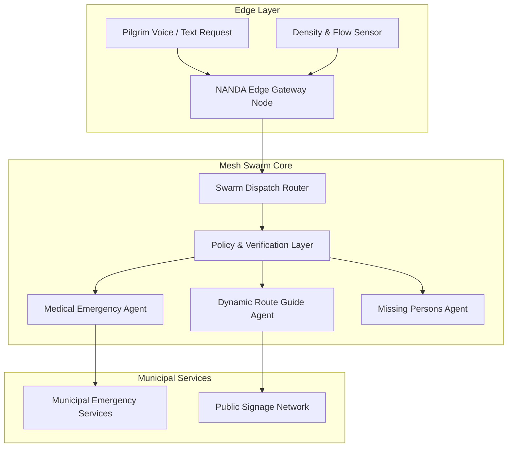
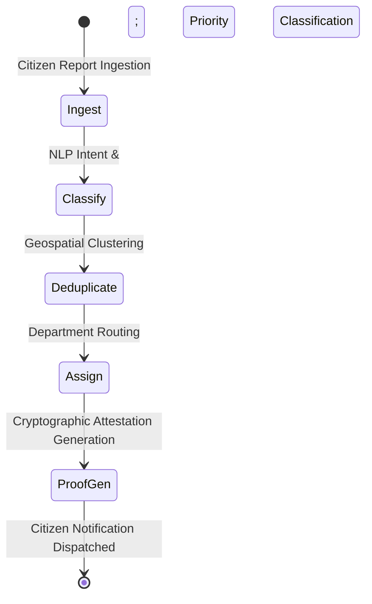

# Reference Implementation

This document details the architectural blueprints used in production deployments of NANDA systems.

---

## 1. KumbhDoot: Mass Gathering Distributed Swarm

The KumbhDoot architecture is designed for extreme network density scenarios where tens of thousands of users submit requests simultaneously over degraded cellular infrastructure.

### Architectural Properties:
- **Local Fallback Inference**: 1.5B/3B parameter quantized SLMs running locally on field gateways ensure essential query processing continues during internet dropouts.
- **Multilingual Speech Pipeline**: Phonetic transcription optimized for low-resource Indic regional dialects.
- **Gossip State Consensus**: Decentralized state synchronization among neighboring edge gateways.

---

## 2. Civic Agents: Complaint Triage Pipeline

---

## Reference Code Repositories

| Component | Repository | Stack |
| :--- | :--- | :--- |
| **Swarm Router Core** | `nandainitiative/swarm-core` | Rust, gRPC, Protobuf |
| **KumbhDoot Gateway** | `nandainitiative/kumbhdoot-edge` | Python, C++, PyTorch |
| **Civic Agents Service** | `nandainitiative/civic-mesh` | Python, FastAPI, SQLite |
| **Verification Ledger** | `nandainitiative/zk-attestation` | Go, Solidity |
