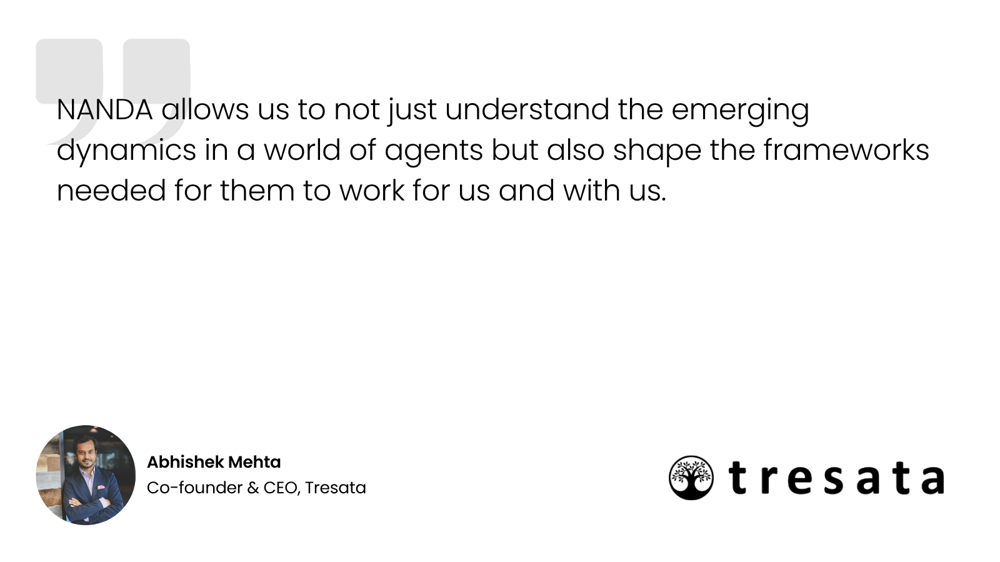
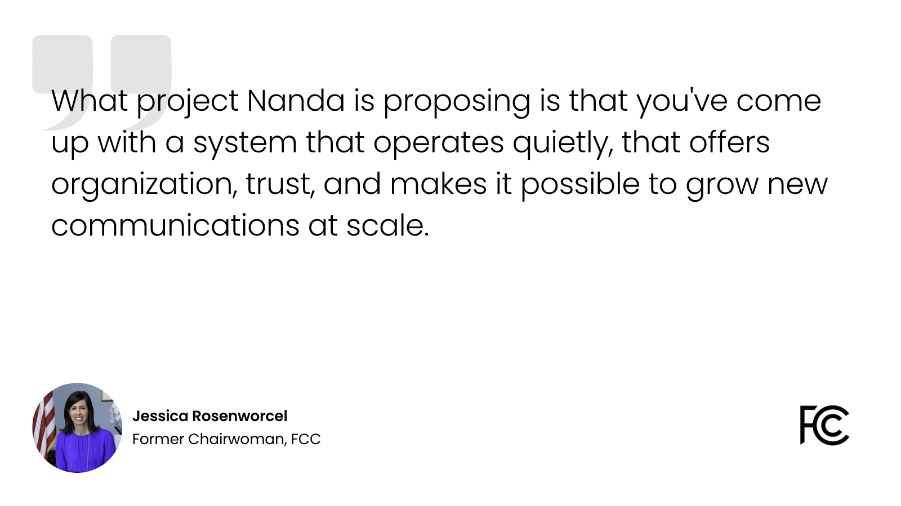
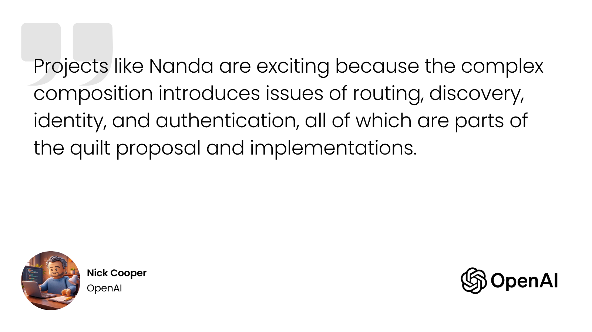
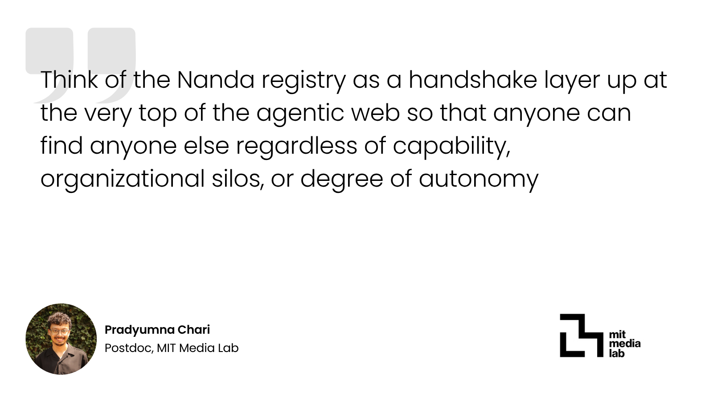
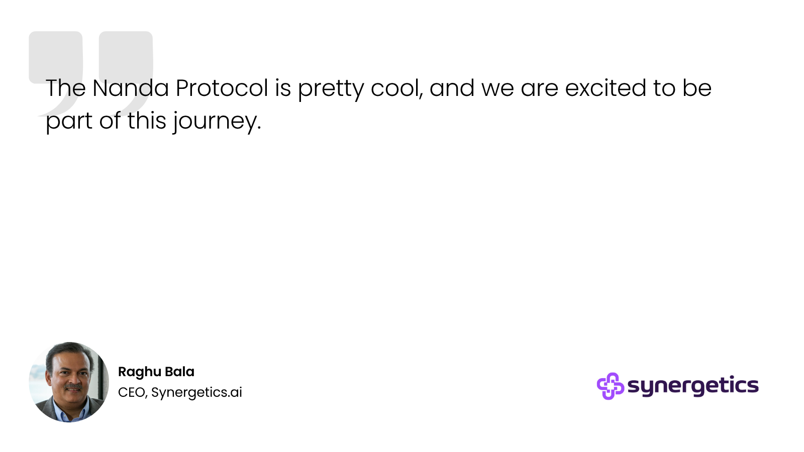
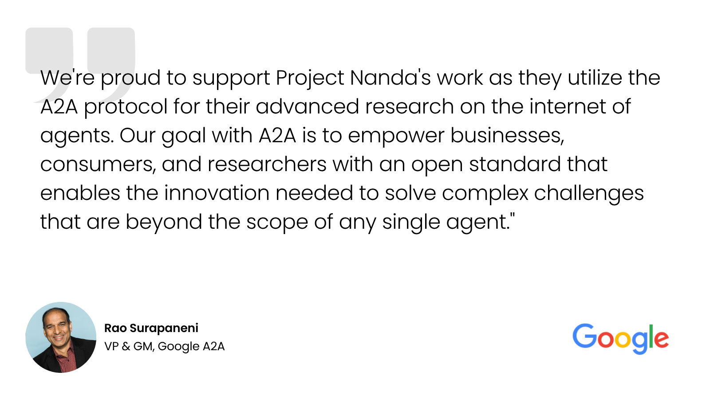
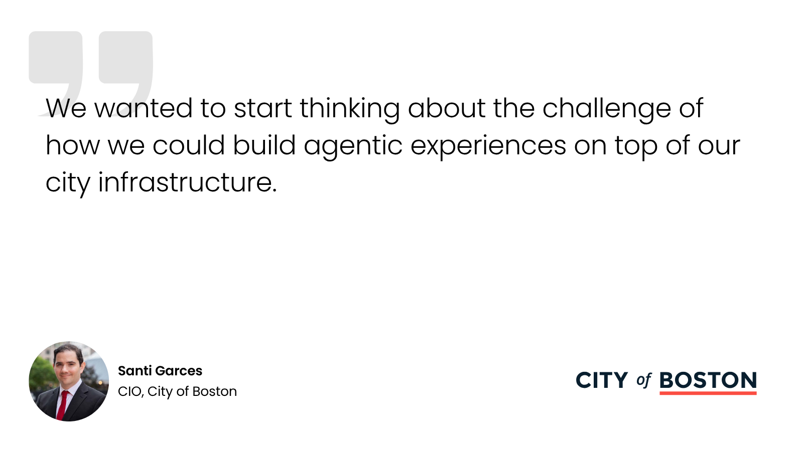
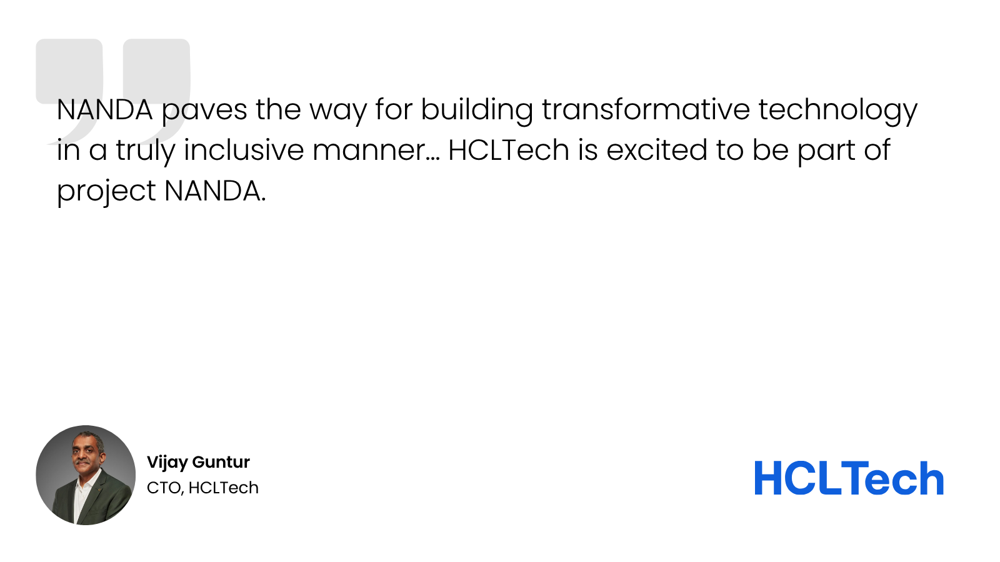
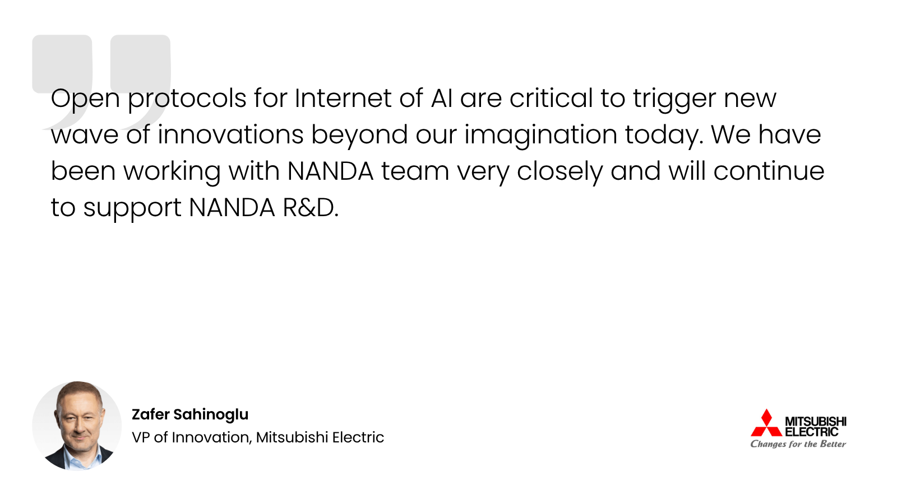

# Networked AI Agents in a Decentralized Architecture {: .nanda-main-title }

Project NANDA is an open initiative for building infrastructure for the Internet of AI Agents.

**Core problem:** Project NANDA is focusing on how billions of AI agents can discover each other, verify capabilities, and coordinate tasks without creating bottlenecks or security vulnerabilities.

---

## What is Project NANDA?

Project NANDA is foundational infrastructure for the open agentic web that lets any client (person or other AI Agent) resolve a stable agent identity to the record it needs to reach that agent — no matter which registry, protocol, or cloud host its owner uses.

Two components make this possible:

* [NANDA Index](http://nandaindex.org) A lightweight directory that only points: identity in, location out. It does not host, run, or store agent data itself.
* [AgentFacts](https://host39.org/) A signed, verifiable record, similar to an ID card, that tells a client what an agent does, where to reach it, who published it, and whether that information is still current.

---

## Why Project NANDA exists

AI agents are being published through many useful systems such as AI Catalog entries, domain records, gateway registries, and sector-specific directories, each solving real problems for the community. This is a healthy innovation, but it also produces discovery islands: a client that knows an identity often has no way to tell which of these mechanisms, if any, is authoritative for it.

Existing domain-based lookup remains the right answer whenever a publisher already owns a domain for that identity. It falls short in three common cases:

* **Enterprises** running mixed stacks where some divisions use AI Catalog and others use DNS-AID or legacy registries.
* **Small and mid-sized businesses** whose agents run on one cloud provider while their agent cards are hosted by a third party.
* **Individuals or informal projects** with no domain of their own, whose personal agent may run on any cloud while its descriptor lives elsewhere entirely.

Project NANDA's position is that the missing piece is not a new protocol but a bootstrap layer that maps identity to the right discovery mechanism before discovery even starts.

---

## What Project NANDA includes

* **NANDA Index**: A federated, multi-operator directory of pointers from identity to authoritative source. Think of it as a quilt of independently run indexes, not one central database.
* **AgentFacts**: A signed capability record for each agent: what it does, how to reach it, and whether it's still valid.
* **Federated resolution architecture**: Separates *where to look* from *what an agent can do*, so no single registry has to hold every answer.
* **NANDA Adapter**: An open-source bridge that brings an existing agent — built with frameworks like LangChain or CrewAI, or custom logic — onto the network and makes it discoverable.
* **NEST (NANDA Exchange Sandbox & Testnet)**: An engine and command-line interface for building, testing, and replaying multi-agent scenarios. It is a test and integration environment, not the universal runtime required to invoke an agent on the open web.
* **Nanda Town**: An open-source sandbox built around NEST for designing and running multi-agent experiments. A scenario defines agents, roles, rules, failures, protocol-layer choices, and metrics in YAML; Nanda Town runs it and records interaction traces as JSON for inspection or replay.

---

## What Project NANDA is not

* **Not an agent runtime or framework** such as LangChain, CrewAI, an ADK, or a model host, and it does not execute agent logic.
* **Not a replacement for MCP, A2A, DNS** or an enterprise identity provider; those systems remain the mechanism through which agents are actually invoked and authenticated.
* **Not one central catalog of every agent.** The index is designed as a federation of independently operated registries, not a single owned database.
* **Not a marketplace** for buying, selling, or ranking agents.

---

## How discovery works

Resolution follows a three-hop pattern:

1. A client knows the agent, organization, person, project, or other stable identity it wants to reach.
2. The NANDA Index points the client to the relevant AgentFacts document, agent card, catalog, registry, gateway, or other approved discovery source.
3. After discovery, the client uses the agent’s own interface, such as MCP, A2A, HTTPS, or another supported protocol, to communicate with or invoke the agent.

Direct domain-based discovery is used first whenever it already applies. NANDA Index is consulted only for identities that existing systems can't resolve on their own.

---

## Words from Advisors

  

    

      
    

    

      
    

    

      
    

    

      
    

    

      
    

    

      
    

    

      
    

    

      
    

    

      
    

    <!-- Duplicate Set for Seamless Infinite Roll -->
    

      
    

    

      
    

    

      
    

    

      
    

    

      
    

    

      
    

    

      
    

    

      
    

    

      
    

  

---

## Where to go next?

* **Researcher**: Learn how to contribute to research, specifications, and working groups through [Get Involved](community/index.md).
* **Enterprise**: Explore implementations for cross-platform agent discovery and interoperability through [Open Source](developer/open-source.md).
* **Government officials and Civic Teams**: See public-interest applications through [Civic Agents](https://civicagents.projectnanda.org/).
* **Developers**: Explore repositories, adapters, tools, and open-source contribution opportunities on [GitHub](https://github.com/projnanda).
* **Student**: Become a student ambassador and help bring open agent-network research and experimentation to your university through [Student Ambassadors](https://www.nandashapers.org/).
* **Lead**: Start a local chapter and convene researchers, developers, civic institutions, and builders in your city through [Start a Chapter](community/start-a-chapter.md).

---

## Who maintains this?

Project NANDA originated as research at the MIT Media Lab and continues to draw on that research, alongside contributors from industry and academic partners. It sits within the [Foundation for Agentic Networks (FAN)](https://www.agenticnet.org/) providing a public-benefit, standards-oriented home for the broader open-agent-network effort.

---

## Open Source & License

Project NANDA's code and research are released under the MIT open-source software license and welcome community contributions.

