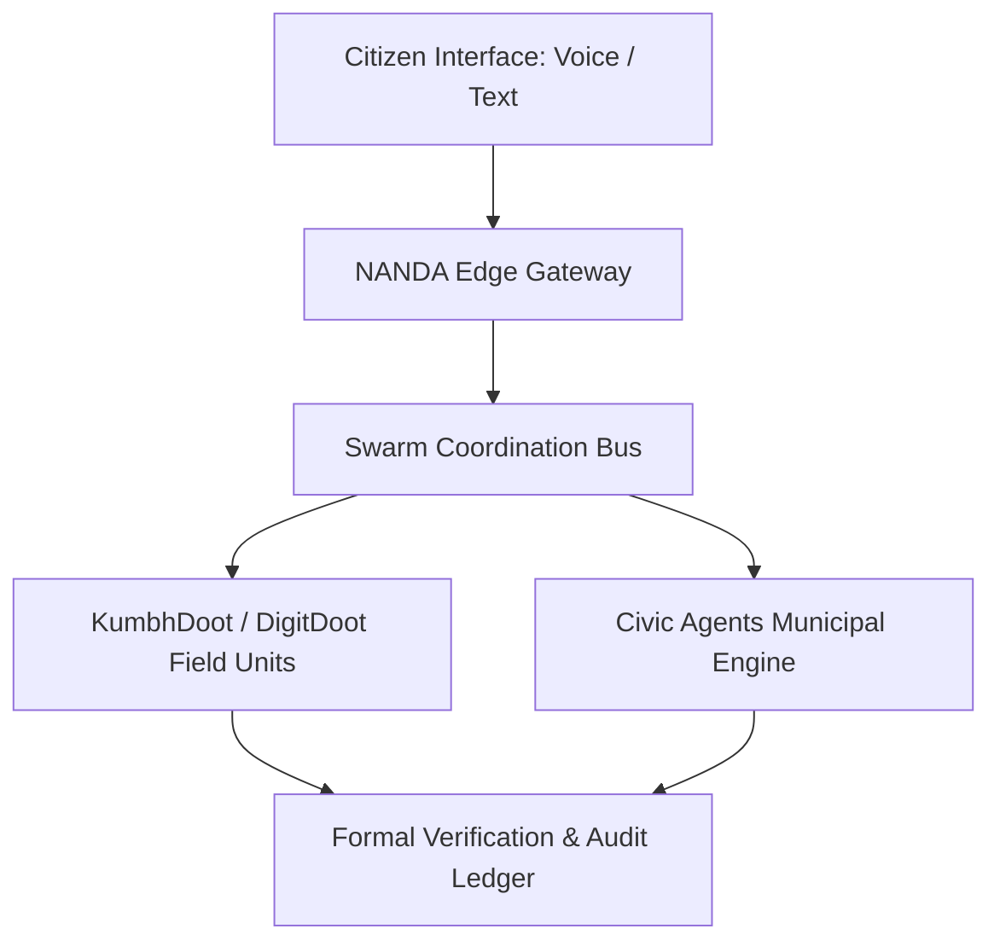

# Projects Overview

The NANDA project ecosystem bridges theoretical research in distributed multi-agent systems with live public deployments. Each project addresses a distinct operational requirement, spanning simulated testbeds, crowd assistance systems, and civic administration workflows.

---

## Active Initiatives

### NANDA Town ↗
*URL: [https://nanda.town](https://nanda.town)*  
NANDA Town is an open simulation environment modeling large-scale socio-technical interactions. Thousands of autonomous agents simulate economic exchange, municipal policy enforcement, and consensus formation within a deterministic, persistent sandbox.

---

### NEST ↗
*URL: [https://nest.nanda.ai](https://nest.nanda.ai)*  
The NANDA Ecosystem Sandbox and Testbed (NEST) provides automated benchmarking and stress testing for agent algorithms prior to real-world deployment. It simulates network partitions, adversarial message injection, and hardware throttling.

---

### KumbhDoot ↗
*URL: [https://kumbhdoot.ai](https://kumbhdoot.ai)*  
KumbhDoot is an autonomous crowd assistance and route optimization platform deployed during mass spiritual gatherings. Operating over localized edge gateways, it provides voice-first multilingual assistance in Indic languages and resolves high-density spatial routing challenges.

---

### DigitDoot ↗
*URL: [https://digitdoot.ai](https://digitdoot.ai)*  
DigitDoot is an agentic platform designed to bridge digital public good access in rural and semi-urban communities. It translates complex administrative requirements into conversational vernacular dialogues for welfare program enrollment and entitlement verification.

---

### Civic Agents ↗
*URL: [https://civicagents.org](https://civicagents.org)*  
Civic Agents is a municipal automation framework for local administrations. It handles citizen grievance intake, geospatial duplicate clustering, automated department routing, and cryptographically verifiable action tracking.

---

## System Architecture

---

## Technical Documentation & Source Code

Refer to the [Developer Portal](../developer/index.md) for SDK specifications and reference implementations of each project.
