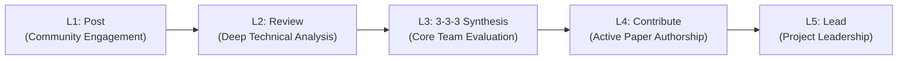

# Writing Lab

The NANDA Writing Lab is an open-science working group where researchers, engineers, and contributors collaboratively author academic papers, technical specifications, and empirical benchmarks for the Internet of AI Agents.

---

## Onboarding Journey: The L1–L5 Pathway

Our 5-level contributor pathway allows anyone to grow from initial community engagement to leading high-impact scientific publications.

---

### Level 1: Post

Begin your journey by engaging with the research. This first step involves reading a NANDA foundational paper, summarizing key insights, and sharing your perspective with the broader AI community.

#### Key Tasks
1. **Read a NANDA Paper**: Select any foundational paper from the [Research Overview](../research/index.md) or [Publications list](index.md).
2. **Summarize & Post on LinkedIn**: Write a 3–4 paragraph summary highlighting the core problem, proposed architecture, and your key takeaways. Tag the official [Project NANDA LinkedIn](https://www.linkedin.com/company/projectnanda/).
3. **Submit Verification**: Complete the [L1 Submission Form](https://forms.gle/BzV4x2xPcBDtbCNT9) with a link to your public post.

| Parameter | Details |
| :--- | :--- |
| **Core Skills** | Reading comprehension, technical summarization, clear written communication |
| **Estimated Bandwidth** | 1–2 hours |
| **Submission** | [L1 Google Form ↗](https://forms.gle/BzV4x2xPcBDtbCNT9) |

---

### Level 2: Review

Dive deeper into architectural and mathematical details. This stage involves conducting a critical, line-by-line review of a NANDA manuscript.

#### Key Tasks
1. **Choose a Paper for Review**: Select one of the following papers:
    - *Beyond DNS: Unlocking the Internet of AI Agents via NANDA Index and Verified AgentFacts*
    - *NANDA Adaptive Resolver: Architecture for Dynamic Resolution of AI Agent Names*
    - *Collaborative Agentic AI Needs Interoperability Across Ecosystems (Web of Agents)*
    - *Evolution of AI Agent Registry Solutions*
2. **Conduct Line-by-Line Review**: Annotate specific sections with technical questions, potential edge cases, structural suggestions, or missing citations.
3. **Upload Review**: Submit your shared Google Doc or PDF via the [L2 Submission Form](https://forms.gle/qtWiTQKL2Jz7Nh2EA).

| Parameter | Details |
| :--- | :--- |
| **Core Skills** | Critical analysis, decentralized systems comprehension, protocol security evaluation |
| **Estimated Bandwidth** | 3–6 hours |
| **Submission** | [L2 Google Form ↗](https://forms.gle/qtWiTQKL2Jz7Nh2EA) |

---

### Level 3: 3-3-3 Synthesis to Become a Core Member

Synthesize your analytical findings into a structured "3-3-3" review and articulate how your background will advance NANDA's research goals.

#### Key Tasks
1. **Author a "3-3-3" Review** for your reviewed paper:
    - **3 Strengths**: Identify three standout conceptual or empirical contributions.
    - **3 Weaknesses**: Pinpoint three areas needing further rigor, empirical validation, or clarity.
    - **3 Changes**: Propose three concrete revisions or experiments.
2. **Skills & Academic Summary**: Write a concise statement describing your technical domain, prior publications or research experience, and intended focus area.
3. **Submit for Core Review**: Complete the [L3 Submission Form](https://forms.gle/TU14TkW29bEGipRn6).

| Parameter | Details |
| :--- | :--- |
| **Core Skills** | High-level synthesis, editorial assessment, strategic value proposition |
| **Estimated Bandwidth** | 2–4 hours |
| **Submission** | [L3 Google Form ↗](https://forms.gle/TU14TkW29bEGipRn6) |

> **Advancement to Core Group**: The NANDA Writing Lab Core Committee reviews all L3 submissions. Invitations to active authoring teams are extended based on review depth, domain relevance, and commitment.

---

### Level 4: Contribute to a Paper

Join an active writing team for an upcoming conference submission or technical specification.

#### Key Tasks
- **Join Active Track**: Collaborate directly with paper leads on working drafts.
- **Section Authorship**: Formulate mathematical proofs, draft core sections, design system diagrams, or run empirical benchmarks.
- **Peer Revision**: Participate in weekly research syncs and reciprocal peer reviews.

| Parameter | Details |
| :--- | :--- |
| **Core Skills** | Collaborative authorship, experimental execution, LaTeX/Markdown drafting |
| **Estimated Bandwidth** | 5–10+ hours / week |
| **Access** | Direct access to NANDA research working groups and manuscript repos |

---

### Level 5: Lead a Paper

Shape the future of open agentic infrastructure. At the highest level, you propose novel research directions, assemble and lead contributor teams from conception to publication, and mentor emerging researchers.

#### Key Tasks
- **Propose Novel Agenda**: Present an architectural hypothesis or empirical research problem aligned with NANDA's roadmap.
- **Direct Research Lifecycle**: Guide the timeline, assign section ownership, run quality control, and coordinate conference submissions.
- **Mentorship**: Guide L1–L4 contributors through the research and publication pipeline.

| Parameter | Details |
| :--- | :--- |
| **Core Skills** | Research leadership, project management, technical vision, academic mentorship |
| **Estimated Bandwidth** | 10–20+ hours / week |
| **Impact** | Primary authorship and co-chairing working groups |

---

## Active Research Tracks & Working Groups

| Track | Current Focus | Primary Deliverable |
| :--- | :--- | :--- |
| **Discovery & Naming** | Decentralized agent lookup, DNS extensions, and resolution | Technical RFC & Prototype |
| **AgentFacts & Trust** | Cryptographic capability attestation and zero-knowledge claim verification | Formal Specification |
| **Interoperability** | Multi-protocol bridging between A2A, MCP, and AGNTCY | Reference Gateway |
| **Coordination & Mesh** | Ripple Effect Protocol and decentralized population alignment | Empirical Simulation |
| **Governance & Policy** | Institutional oversight, federated registries, and multistakeholder frameworks | Policy Whitepaper |

---

## Submission & Inquiry

For external collaborations, university partnerships, or inquiries regarding the Writing Lab onboarding workflow, contact the research committee at `research@nanda.ai` or join our [Community Discussions](../community/index.md).
