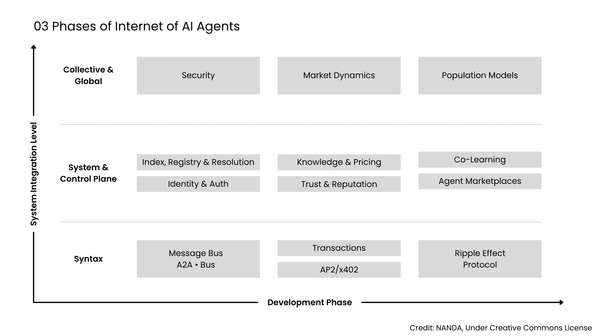
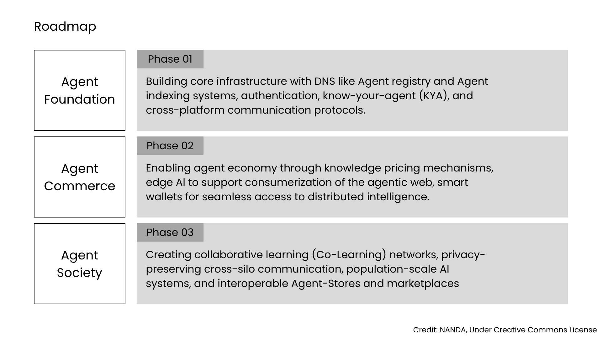

# Research Overview

## Project NANDA

Research at Project NANDA is developing an infrastructure for an Internet of AI Agents: an ecosystem in which agents can find one another, establish identity and capabilities, and coordinate across organizational boundaries. Its main research focus is the NANDA Index and the discovery mechanisms around it. The Index acts as a shared resolution layer that can connect public, private, and third-party agent registries without requiring every agent to belong to a single central directory.

The Index resolves an agent name or identifier to information needed for interaction. This information may include endpoints, supported protocols, declared capabilities, credentials, and security requirements. AgentFacts provides a verifiable way to publish these details while allowing implementations and registries to remain distributed.

NANDA is not an agent framework, an agent builder, or a model-development lab. It does not replace frameworks that construct or run agents; it provides infrastructure through which independently built agents can become discoverable and work across systems.

---

## Our Philosophy

Project NANDA is based on a broader research direction described in [A Perspective on Decentralizing AI](https://www.media.mit.edu/projects/decentralized-ai/overview/). Decentralized AI studies how organizations and individuals can collaborate without placing all data, computation, or decision-making under one institution. Participants retain local control of their resources and objectives, including in settings where they do not fully trust one another.

This approach identifies five connected challenges:

* **Privacy:** enabling useful computation while sensitive data remains protected and organizational boundaries are preserved.  
* **Verifiability:** establishing the origin, integrity, and quality of contributions without requiring unrestricted access to private data or systems.  
* **Incentives:** giving participants appropriate reasons to contribute data, computation, knowledge, or other resources.  
* **Orchestration:** coordinating heterogeneous participants and workloads without concentrating control in a central orchestrator.  
* **Crowd UX:** making decentralized systems understandable and usable so that people can discover collaborators, evaluate choices, and participate without managing the underlying complexity.

Together, these challenges define a self-organizing model of AI collaboration. Privacy and verifiability establish the conditions for trust; incentives support participation; orchestration connects distributed resources; and crowd UX provides an accessible interface to the system.

Project NANDA addresses the network layer. Its work on discovery, identity, protocol interoperability, and initial handshake mechanisms is intended to let agents coordinate across organizational silos without depending on a single portal or platform.

---

## Development Roadmap

Project NANDA’s roadmap describes the development of an Internet of AI Agents in three phases. It begins with the infrastructure required to identify and connect agents, then adds mechanisms for economic exchange, and finally considers coordination and learning across large agent populations.

{ loading=lazy }

The three development phases:

{ loading=lazy }

Each phase develops at more than one level. The lower layer provides protocols for communication or exchange; the control layer handles identity, discovery, pricing, reputation, and coordination; and the collective layer addresses system-wide questions such as security, market dynamics, and population behavior.

A city provides a simple analogy. A2A supplies the streets over which agents communicate, while MCP provides access to tools inside buildings. The NANDA Index is the address system, AgentFacts is the passport, and NEST is the test track. Markets, neighborhoods, and population-scale coordination come later, after the foundational infrastructure is in place.

---

## Three-Prong Approach

Project NANDA is organized around three related forms of work:

* **Technology:** research on open standards, protocols, and reference implementations for discovery, identity, interoperability, and attestation. 
* **Social mission:** community and governance work intended to keep the Agentic Web open and prevent its shared infrastructure from becoming a collection of closed directories. 
* **Venture ecosystem:** support for a plural economy of implementations, services, and organizations, so that agent discovery and exchange do not collapse into a single platform.

These areas serve different purposes but share the same premise: common infrastructure should permit multiple technical implementations, communities, and economic participants to coexist.

---

## Featured Papers

[**Upgrade or Switch: Do We Need a Next-Gen Trusted Architecture for the Internet of AI Agents?**](https://arxiv.org/abs/2506.12003) 
Examines whether existing Internet infrastructure should be extended for autonomous agents or supplemented by purpose-built registry and index architectures, and argues that hybrid approaches are likely.

[**Beyond DNS: Unlocking the Internet of AI Agents via the NANDA Index and Verified AgentFacts**](https://arxiv.org/abs/2507.14263) 
Presents the NANDA Index, AgentFacts, and adaptive resolution as an architecture for discoverable, identifiable, and verifiable agents across organizational boundaries.

[Explore More](../publication/index.md)
