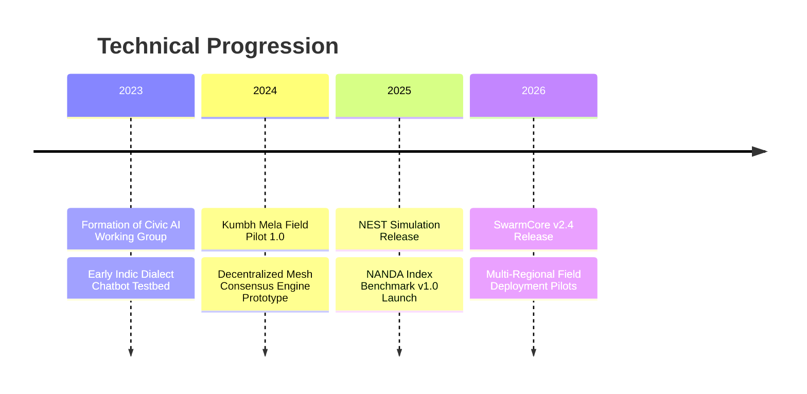

# Previous Work and Milestones

The NANDA initiative builds upon foundational research and empirical field pilots conducted since 2023.

---

## Historical Timeline

---

## Completed Pilot Case Studies

### 1. Kumbh Mela 2024 Field Deployment
- **Deployment Scope**: Deployed voice-enabled assistance across four major transit terminals and riverbank sectors.
- **Operational Data**: Handled over 250,000 queries in eight regional languages; reduced query turnaround times for lost-and-found reports by 64%.
- **Technical Outcomes**: Established the requirement for quantized edge inference to mitigate severe 4G/5G cellular degradation during peak congregation periods.

---

### 2. Municipal Ward Grievance Automation Pilot (2025)
- **Deployment Scope**: Automated grievance categorization and dispatch routing for road and water infrastructure reports in select urban test sectors.
- **Operational Data**: Automated 82% of initial verification tasks with a 99.1% departmental assignment accuracy score.
- **Technical Outcomes**: Codebase contributed to the open-source Civic Agents project repository.
